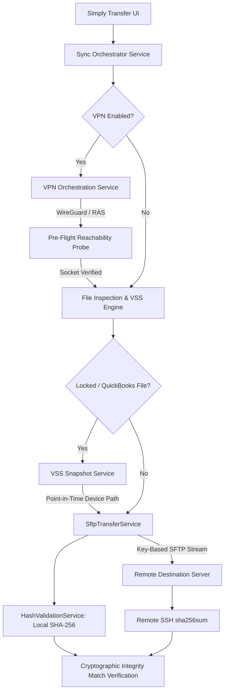

# Simply Transfer

[](https://dotnet.microsoft.com/)
[](https://microsoft.com)
[](https://openssh.com)
[](#security-model)
[](LICENSE)

**Simply Transfer** is an enterprise-grade Windows desktop file synchronization utility engineered for secure peer-to-server data protection. Combining pure SSH key-authenticated SFTP, automated pre-flight VPN orchestration (WireGuard and RAS), and Microsoft Windows Volume Shadow Copy Service (VSS) snapshotting, Simply Transfer safely backs up live, open, and exclusively locked files (such as active QuickBooks `.qbw` and `.tlg` databases) without interruption or data corruption.

---

## Key Features

- **Point-in-Time VSS Snapshotting**: 
  Integrates natively with the Windows Volume Shadow Copy Service (via AlphaVSS) to take atomic point-in-time volume snapshots. Seamlessly reads and backs up open, exclusively locked databases (such as active QuickBooks Company Files) without requiring applications to close.
- **Pure Public-Key Authentication**: 
  Strict security policy strictly prohibits plaintext password authentication. Fully supports modern Ed25519 and RSA (2048/4096-bit) private keys with optional passphrase protection.
- **Windows DPAPI Protection at Rest**: 
  Private key passphrases and key blobs are encrypted using the Windows Data Protection API (`ProtectedData`), tied directly to the current user profile context.
- **Pre-Flight VPN Orchestration**: 
  Natively initiates WireGuard tunnels (via Windows Service or `wg-quick`) or Windows Remote Access Service (RAS/`rasdial`) before establishing SFTP sessions. Includes an automated TCP socket reachability probe to ensure the remote host is accessible through the tunnel prior to commencing transfers.
- **Two-Step Cryptographic Verification**: 
  Computes a local SHA-256 hash across the streaming byte pipeline during transfer, then executes a remote `sha256sum` over SSH on the destination host to verify byte-level cryptographic integrity.
- **Modern Dark-Slate WPF Interface**: 
  Crafted with MVVM CommunityToolkit, featuring a multi-select file browser with QuickBooks detection badges, real-time speed/progress monitoring, interactive validation badges, and searchable audit logs.
- **Portable Profile Management**: 
  Profiles are persisted to `%APPDATA%\SimplyTransfer\profiles.json` and can be exported/imported as portable JSON packages (with machine-specific secrets stripped for safe distribution).

---

## Architectural Overview



---

## System Requirements

| Requirement | Specification |
| :--- | :--- |
| **Operating System** | Windows 10 (1809 or higher), Windows 11, Windows Server 2016, 2019, 2022 (x64) |
| **Framework Runtime** | [.NET 8.0 Windows Desktop Runtime](https://dotnet.microsoft.com/download/dotnet/8.0) *(not required for self-contained builds)* |
| **Execution Privileges** | **Administrator** recommended (required for VSS snapshot creation; standard user privileges supported when VSS is disabled) |
| **Target Server** | OpenSSH Server (Linux, Unix, or Windows) with SFTP subsystem and `sha256sum` utility |
| **Optional Services** | WireGuard for Windows (for WireGuard tunnels) or Windows RAS (for dial-up/SSTP/IKEv2 VPNs) |

---

## Prerequisites & Server Setup

### 1. Automated Host & OpenSSH Setup (Recommended)

A dedicated host provisioning script [setup-prerequisites.ps1](setup-prerequisites.ps1) is included in the project root to configure local and remote prerequisites:

```powershell
# Run host inspection, enable OpenSSH capabilities/services, and provision keys
.\setup-prerequisites.ps1

# Self-elevate as Administrator to configure services and firewall automatically
.\setup-prerequisites.ps1 -Elevate

# Automatically install missing dependencies (.NET 8 runtime, VC++ Redist) and create desktop shortcut
.\setup-prerequisites.ps1 -InstallMissingDependencies -CreateDesktopShortcut
```

The script performs the following tasks:
1. **OpenSSH Configuration**: Installs OpenSSH Client & Server capabilities, configures `sshd` and `ssh-agent` services to Automatic startup, and creates inbound Windows Firewall rules for Port 22.
2. **Key Provisioning & Security**: Generates modern Ed25519 SSH keys (`~/.ssh/id_ed25519`) and applies strict Windows NTFS ACL permissions (accessible only by the user and SYSTEM).
3. **Dependency Gathering & Validation**: Inspects and optionally installs [.NET 8 Desktop Runtime](https://dotnet.microsoft.com/download/dotnet/8.0) and Microsoft Visual C++ 2015–2022 Redistributable (x64) required by AlphaVSS.
4. **Service Verification**: Checks Volume Shadow Copy Service (VSS) and WireGuard VPN client availability.
5. **Application Profile Auto-Population**: Automatically populates `%APPDATA%\SimplyTransfer\profiles.json` with the generated private key path (`~/.ssh/id_ed25519`) so the UI is pre-configured out-of-the-box.
6. **Prerequisites Audit Report**: Writes a detailed audit file (`prerequisites-report.txt`) to the project root and `%APPDATA%\SimplyTransfer\`, including the exact public key string for easy copying.
7. **Interactive Review**: Pauses at completion so terminal output and next steps remain visible (use `-NoPause` for headless execution).

---

### 2. Destination Server Setup & Key Assignment (`dest_prerequisites.ps1`)

To be run **after** `setup-prerequisites.ps1` to configure the destination host and assign the required keys:

```powershell
# Standard destination setup (auto-detects public key from setup-prerequisites):
.\dest_prerequisites.ps1 -Elevate

# Or configure destination for a specific user and directory:
.\dest_prerequisites.ps1 -DestinationUser "AdminUser" -DestinationDirectory "C:\Backups" -Elevate

# Or authorize a specific client public key string on the destination:
.\dest_prerequisites.ps1 -ClientPublicKey "ssh-ed25519 AAAAC3NzaC1lZDI1NTE5..." -Elevate
```

The script performs the following tasks on the destination server:
1. **OpenSSH Server Verification**: Ensures OpenSSH Server capability is installed and binary is present.
2. **OpenSSH Host Keys Generation**: Generates missing host keys (`ssh-keygen -A`).
3. **Client Public Key Discovery & Provisioning**: Automatically acquires the public key generated by `setup-prerequisites.ps1` from local `~/.ssh/id_ed25519.pub` or `prerequisites-report.txt` (or accepts `-ClientPublicKey`).
4. **Authorized Keys Hardening**:
   - For **Administrator** users: configures `C:\ProgramData\ssh\administrators_authorized_keys` with strict NTFS ACLs (`Administrators:F`, `SYSTEM:F`), resolving the Windows OpenSSH admin bypass.
   - For **Standard** users: configures `C:\Users\<user>\.ssh\authorized_keys` with strict NTFS ACLs.
5. **Service Management**: Sets `sshd` and `ssh-agent` to Automatic startup and restarts `sshd` to load updated keys.
6. **Firewall Inbound Rule**: Configures Windows Defender Firewall to allow Port 22 inbound.
7. **Destination Directory Creation**: Pre-creates and configures write permissions on the target directory (default: `C:\Backups`).
8. **Remote Deployment Script Generation**: Emits a standalone `deploy-to-remote-dest.ps1` pre-populated with your public key for running on other remote servers.
9. **Destination Audit Report**: Writes `dest-prerequisites-report.txt` with recommended profile settings.

---

### 3. Manual SSH Key Generation (Alternative)
Password authentication is strictly disabled by policy. If generating keys manually, run:

```powershell
ssh-keygen -t ed25519 -C "backup-sync-service" -f "$env:USERPROFILE\.ssh\id_ed25519"
```

### 4. Configure Linux / macOS Destination Authorized Keys
Append the public key (`id_ed25519.pub`) to the target server's `~/.ssh/authorized_keys`:

```bash
cat id_ed25519.pub >> ~/.ssh/authorized_keys
chmod 600 ~/.ssh/authorized_keys
chmod 700 ~/.ssh
```

Ensure the remote OpenSSH daemon (`/etc/ssh/sshd_config`) allows public key authentication and has SFTP enabled:

```text
PubkeyAuthentication yes
Subsystem sftp /usr/lib/openssh/sftp-server
```

---

## Building & Publishing for Deployment

### Automated Deployment (PowerShell)

A PowerShell deployment script is included in the project root:

```powershell
# Self-contained single-file deployment (default, zero runtime dependencies)
.\publish.ps1

# Custom output destination
.\publish.ps1 -OutputDir ".\dist\SimplyTransfer-Release"
```

The script performs the following tasks:
1. Restores all NuGet packages and builds the solution in `Release` configuration.
2. Executes the full automated unit test suite (`SimplyTransfer.Tests`).
3. Publishes `SimplyTransfer.UI` as a single-file self-contained executable targeted for `win-x64`.
4. Embeds all prerequisite and destination setup scripts directly as compiled assembly resources (`<EmbeddedResource>`), allowing in-process execution via the official Microsoft .NET PowerShell SDK (`Microsoft.PowerShell.SDK`) without triggering Windows PowerShell execution policy restrictions (`Restricted`, `RemoteSigned`) or process auditing alarms.
5. Copies and colocates native AlphaVSS binaries (`AlphaVSS.x64.dll`, `Ijwhost.dll`) alongside the single executable.

### Manual CLI Build (Single-File Enforced)

```powershell
# Restore dependencies
dotnet restore .\SimplyTransfer.sln

# Run test suite
dotnet test .\SimplyTransfer.sln -c Release

# Publish self-contained single-file Windows x64 package
dotnet publish .\SimplyTransfer.UI\SimplyTransfer.UI.csproj `
  -c Release `
  -r win-x64 `
  --self-contained `
  -p:PublishSingleFile=true `
  -p:IncludeNativeLibrariesForSelfContained=true `
  -o .\dist\SimplyTransfer-Release
```

---

## User Guide

### 1. Launching the Application
For VSS Volume Shadow Copy snapshots of live QuickBooks company files, right-click `SimplyTransfer.UI.exe` and select **Run as administrator**.

### 2. Configuring a Profile
1. Select **+ New** to create a profile or customize the **Default Profile**.
2. **SFTP Host & Port**: Enter the hostname or IP address of the target server and the SSH port (default: `22`).
3. **SSH Username**: Enter the remote login username.
4. **Private Key Path**: Click **Browse...** to select your `id_ed25519` or `id_rsa` private key file.
5. **Key Passphrase**: If your key is encrypted with a passphrase, enter it. The passphrase is automatically encrypted with Windows DPAPI when saved.
6. **Remote Destination Directory**: Specify the destination path on the server (e.g., `/var/backups/company_data/`).
7. **Pre-Flight VPN (Optional)**:
   - Check **Enable Pre-Flight VPN Connection**.
   - Choose **WireGuard** or **RAS**.
   - Enter the connection name (e.g., `wg0`) or browse to select your `.conf` file.
   - Configure **Probe Timeout** (recommended: 15–30 seconds).
8. **VSS Snapshotting**:
   - Ensure **Use Windows VSS Snapshots for locked files** is checked.
   - Check **Automatically detect QuickBooks databases** to highlight `.qbw`, `.tlg`, `.qbb`, and `.nd` files.
9. Click **Save Profile Changes**.

### 3. Executing a Sync
1. In the **Local File Browser**, expand drives and check the boxes next to files or folders you want to synchronize.
2. Click **▶ Start SFTP Sync**.
3. Observe real-time progress:
   - **VPN Connection**: Tunnel establishes and socket connectivity is verified.
   - **VSS Snapshots**: Shadow volume is created and device paths are mounted.
   - **Stream Upload**: Data uploads directly with live MB/s throughput.
   - **Validation**: Local SHA-256 and remote `sha256sum` are compared.
   - **Integrity Status**: Displays **Verified** upon cryptographic match.

---

## Security Model

- **No Passwords on Wire or Disk**: The application cannot store or transmit plaintext SSH passwords. All authentication is exclusively key-based.
- **DPAPI Cryptographic Isolation**: Sensitive material (passphrases and keys) stored in `%APPDATA%\SimplyTransfer\profiles.json` are encrypted using `ProtectedData.Protect` under `DataProtectionScope.CurrentUser`. Stored secrets cannot be decrypted by another user account or another machine.
- **Sanitized Exports**: When exporting profiles to JSON, secrets are excluded by default to ensure profiles can be shared safely across team members.
- **Path Normalization**: Remote file and directory paths are strictly normalized to Unix formatting and single-quote escaped for remote shell invocations, preventing command injection vulnerabilities.

---

## Project Structure

```text
Simply_Transfer/
├── SimplyTransfer.sln                # Visual Studio / MSBuild Solution
├── .gitignore                        # Git ignore definitions
├── publish.ps1                       # Automated release and deployment script
├── LICENSE                           # GNU General Public License v3
├── README.md                         # Project documentation
│
├── SimplyTransfer.Core/              # Core business logic and infrastructure
│   ├── Models/
│   │   ├── SyncProfile.cs            # Configuration profile model
│   │   └── TransferItem.cs           # File transfer queue item & status enums
│   └── Services/
│       ├── ConfigurationService.cs   # JSON profile persistence & export/import
│       ├── HashValidationService.cs  # Streaming SHA-256 hash computation
│       ├── SecurityService.cs        # Windows DPAPI encryption routines
│       ├── SftpTransferService.cs    # SSH.NET key-based SFTP client & SSH commands
│       ├── SyncOrchestratorService.cs# 5-phase synchronization lifecycle engine
│       ├── VpnOrchestrationService.cs# WireGuard and RAS tunnel management
│       └── VssSnapshotService.cs     # AlphaVSS Volume Shadow Copy engine
│
├── SimplyTransfer.UI/                # WPF Presentation Layer (.NET 8 LTS)
│   ├── App.xaml / App.xaml.cs        # DI composition root & application startup
│   ├── MainWindow.xaml / .cs         # Dark-slate enterprise user interface
│   ├── app.manifest                  # DPI awareness and elevation manifest
│   ├── Controls/
│   │   └── ValidationBadge.xaml / .cs# Dynamic cryptographic validation badge
│   └── ViewModels/
│       ├── FileBrowserViewModel.cs   # Multi-select lazy-loading tree view model
│       └── MainViewModel.cs          # Main window state, commands, and events
│
└── SimplyTransfer.Tests/             # Automated Unit Testing Suite (xUnit)
    ├── ConfigurationServiceTests.cs  # Profile serialization & portability tests
    ├── FileNodeTests.cs              # File tree selection & QuickBooks detection
    ├── HashValidationServiceTests.cs # Known SHA-256 validation tests
    ├── SecurityServiceTests.cs       # DPAPI encryption & round-trip tests
    └── ViewModelTests.cs             # Dependency injection & UI state tests
```

---

## Troubleshooting

### VSS Authorization Error
- **Symptom**: `VSS Volume Shadow Copy creation requires Administrator privileges.`
- **Resolution**: Right-click `SimplyTransfer.UI.exe` and select **Run as administrator**. Windows limits Volume Shadow Copy APIs (`IVssBackupComponents`) to elevated administrator processes.

### Pre-Flight Probe Timeout
- **Symptom**: `Pre-flight reachability probe failed: host:port is not reachable via tunnel within 20s.`
- **Resolution**: Verify that the remote host firewall permits SSH connections on the designated port over the VPN subnet. Check your WireGuard configuration (`AllowedIPs`) or Windows RAS routing table.

### Remote Hash Parse Failure
- **Symptom**: `Unable to parse SHA-256 hash from remote response.`
- **Resolution**: Verify that the remote host environment has `sha256sum` (coreutils) or `shasum` available in the default non-interactive SSH `$PATH`.

---

## License

This program is free software: you can redistribute it and/or modify it under the terms of the [GNU General Public License](LICENSE) as published by the Free Software Foundation, either version 3 of the License, or (at your option) any later version.
